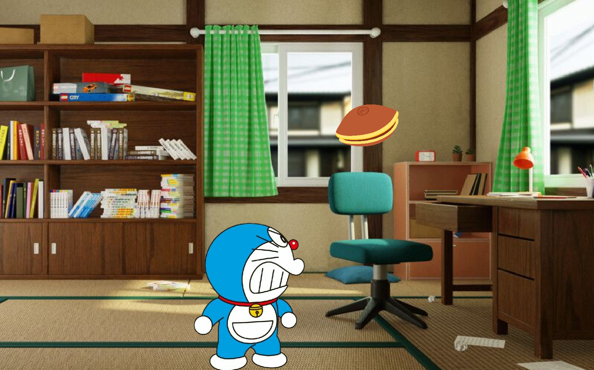

# Doraemon VS Doracake

A simple falling objects game built with [libGDX](https://libgdx.com/).

## Overview

**Doraemon VS Doracake** is a cross-platform game where you control Doraemon to catch falling Doracakes. The project uses libGDX and supports desktop (LWJGL3) out of the box.

## Features

- Move the Doraemon using keyboard or touch input
- Catch falling doracakes
- Background music and sound effects
- Responsive viewport and smooth animation

## Screenshots



## Project Structure

- `core/`: Shared game logic and assets
- `lwjgl3/`: Desktop launcher using LWJGL3
- `assets/`: Game assets (images, sounds)
- `build.gradle`, `settings.gradle`: Project configuration

## Getting Started

### Prerequisites

- Java 8 or higher
- [Gradle](https://gradle.org/) (or use the included Gradle wrapper)

### Running the Game

To run the desktop version:

```sh
git clone https://github.com/MAHanupriSAR/Doraemon_VS_Doracakes.git
cd Doraemon_VS_Doracakes
./gradlew lwjgl3:run
```

### Building a JAR

To build a runnable JAR:

```sh
git clone https://github.com/MAHanupriSAR/Doraemon_VS_Doracakes.git
cd Doraemon_VS_Doracakes
./gradlew lwjgl3:jar
```

The output will be in `Doraemon_VS_Doracakes/lwjgl3/build/libs/`

## Controls

- **Left/Right Arrow Keys**: Move the Doraemon
- **Touch/Mouse Drag**: Move the Doraemon (if supported)
- **Catch** the falling doracakes

## Assets

All game assets are located in the `assets/` folder.

## Credits

This game was created by following the [libGDX "A Simple Game" tutorial](https://libgdx.com/wiki/start/a-simple-game).

## License

This project is licensed under the terms of the [MIT License](LICENSE).

---
